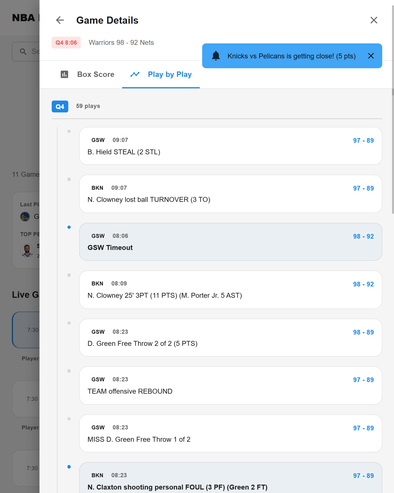
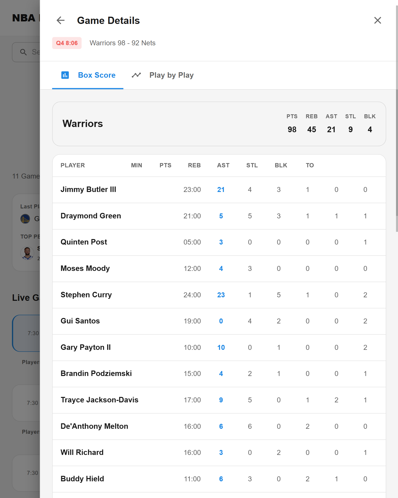
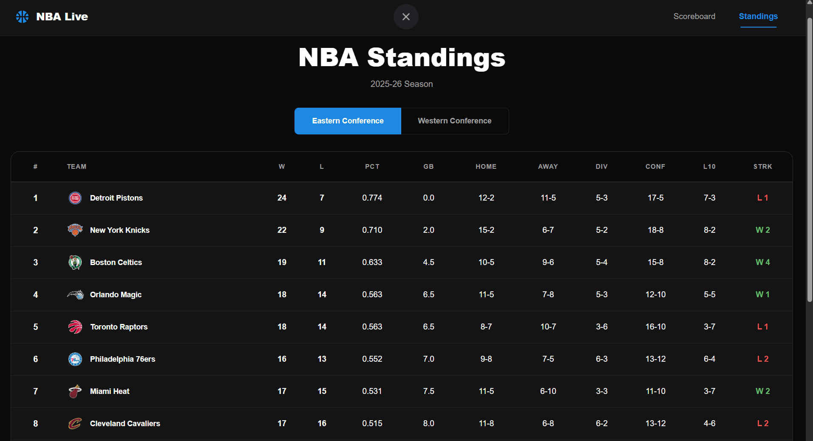
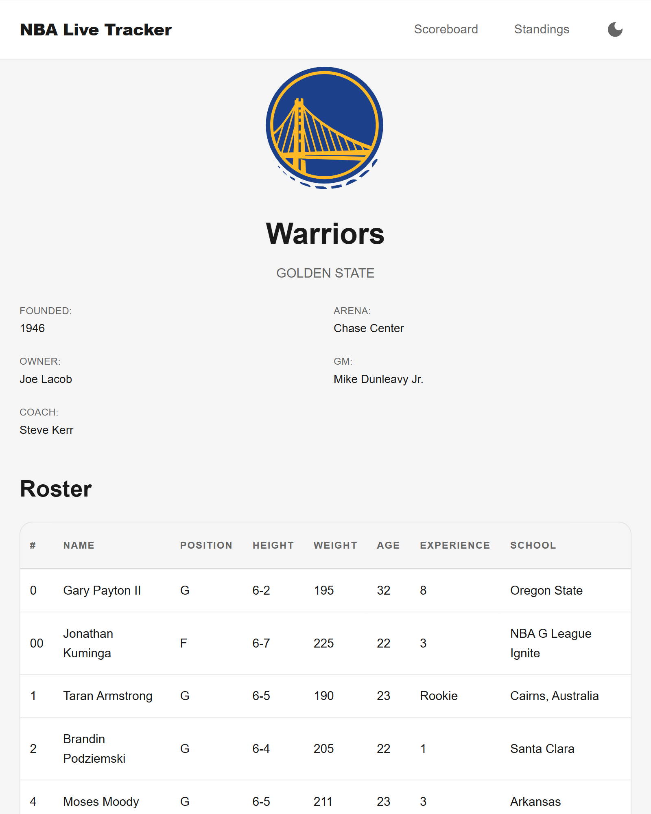

# NBA Live Tracker

A real-time NBA scoreboard and stats tracker built with React and FastAPI. Watch live games, track player stats, browse team rosters, and stay up-to-date with league standings.

## Screenshots

<div align="center">
  
  
  
  <br>
  
  
  
</div>

## Features

- **Live Scoreboard** - Real-time score updates as games happen
- **Play-by-Play** - See every shot, foul, and timeout as it happens
- **Player Profiles** - View player stats and recent game performances
- **Team Rosters** - Browse full team lineups with player details
- **League Standings** - Track playoff races and conference rankings
- **Smart Search** - Find players and teams instantly

## Quick Start

### Using Docker

```bash
git clone https://github.com/Warsame-Egal/nba-live-tracker.git
cd nba-live-tracker
docker-compose up --build
```

Then open:

- Frontend: http://localhost:3000
- Backend API: http://localhost:8000
- API Docs: http://localhost:8000/docs

### Manual Setup

**Backend:**

```bash
cd nba-tracker-api
python -m venv venv
venv\Scripts\activate
pip install -r requirements.txt
uvicorn app.main:app --reload
```

**Frontend:**

```bash
cd nba-tracker
npm install
npm run dev
```

## Tech Stack

**Frontend:** React 19, TypeScript, Material UI, Vite, React Router, WebSockets

**Backend:** FastAPI, Python 3.12+, nba_api, WebSockets, Uvicorn

## API Documentation

- Interactive docs: http://localhost:8000/docs
- Full documentation: [API_DOCUMENTATION.md](nba-tracker-api/app/docs/API_DOCUMENTATION.md)

## Project Structure

```
nba-live-tracker/
├── nba-tracker/          # Frontend React app
│   ├── src/
│   │   ├── components/   # UI components
│   │   ├── pages/        # Page components
│   │   ├── services/     # API services
│   │   └── types/        # TypeScript types
│   └── public/           # Static assets
└── nba-tracker-api/      # Backend FastAPI app
    └── app/
        ├── routers/       # API routes
        ├── services/     # Business logic
        └── schemas/       # Data models
```

## License

This project is open source. See the [LICENSE](LICENSE) file for details.

---

Made by Warsame Egal
