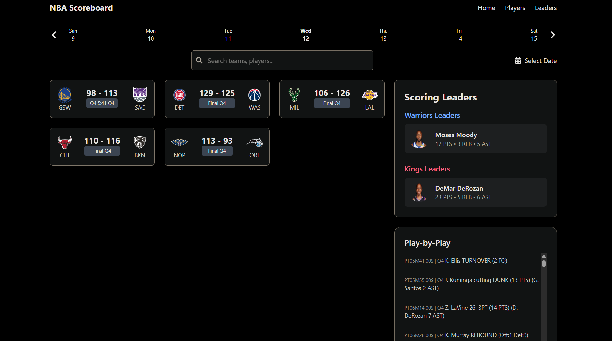

The **NBA Scoreboard API** is a FastAPI backend that provides real-time and historical NBA game data for frontend applications.  
It serves as a middle layer, fetching raw data from the [`nba_api`](https://github.com/swar/nba_api) package,
processing it, and exposing structured, developer-friendly API endpoints.

### **What This API Does**

- **Fetches and processes data** from the NBA's live API (`nba_api`).
- **Enhances and standardizes responses** for easy integration.
- **Exposes custom RESTful API endpoints** designed specifically for frontend use.

## Features

- Live scoreboard with real-time game updates
- Box score breakdown with player and team stats
- Game leaders (top performers in points, assists, and rebounds)
- Play-by-play breakdown of game events
- Team schedule, records, and rosters
- Player search and detailed stats

## Create & Activate Virtual Environment

    cd nba-live-tracker/nba-tracker-api
    python -m venv venv
    venv\Scripts\activate

## Install Dependencies

    pip install -r requirements.txt

## Running the API

    Once the server is running, access the API documentation and test endpoints at:

- **Swagger UI:** [http://localhost:8000/docs](http://localhost:8000/docs)
- **Redoc:** [http://localhost:8000/redoc](http://localhost:8000/redoc)
- **Main API Page:** [http://localhost:8000](http://localhost:8000)

## Backend (FastAPI)

    Python 3.x
    FastAPI
    nba_api
    Pydantic

## Frontend (React)

    React.js
    TypeScript
    Tailwind CSS
    Vite
