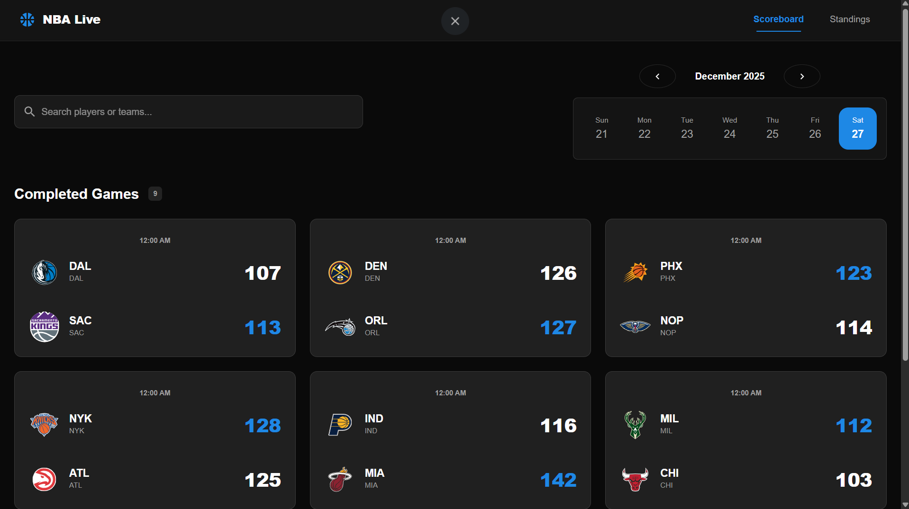
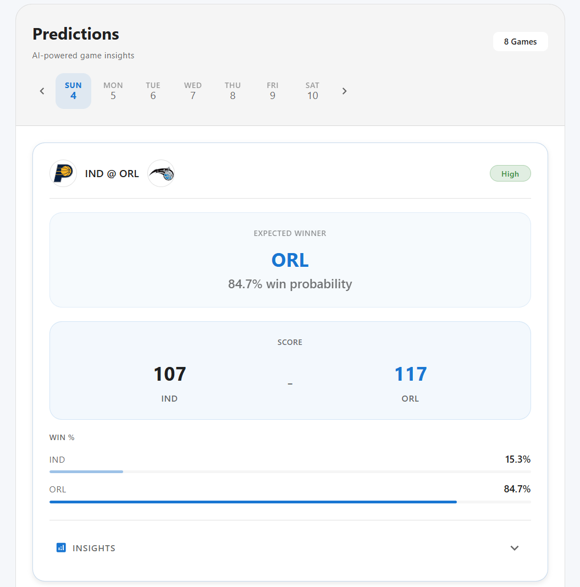
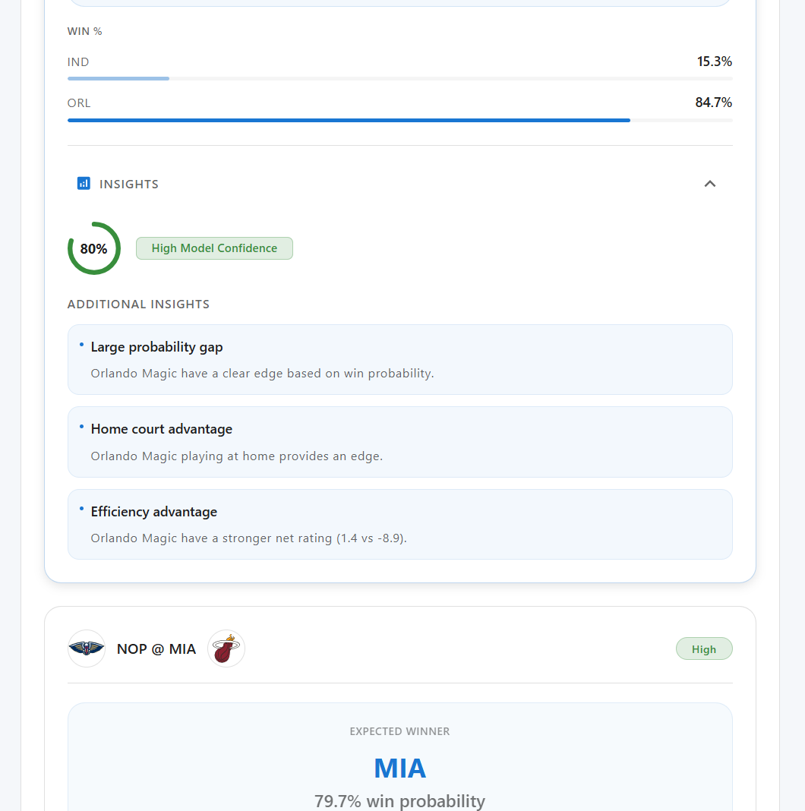
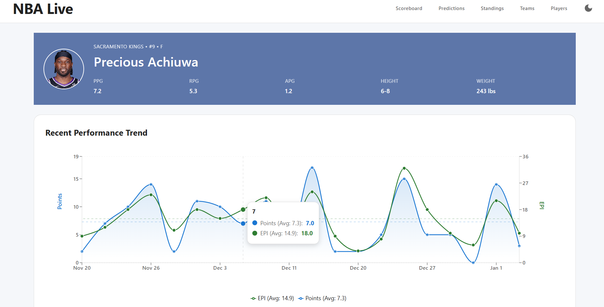

# NBA Live Tracker

Real-time NBA scoreboard and stats tracker. Watch live games with play-by-play updates, AI-powered insights, and stat-based predictions.

**Live Demo:** [https://nba-live-tracker-one.vercel.app](https://nba-live-tracker-one.vercel.app)

## What It Does

A web app that shows live NBA game scores, player stats, team information, and game predictions. Built with React and FastAPI. Uses the `nba_api` library to fetch data from NBA.com.

**Live Scoreboard:**

- Real-time score updates via WebSocket
- Play-by-play updates as they happen
- AI insights powered by Groq that explain what's happening in games
- Lead change explanations that break down why the score changed

**Predictions:**

- Stat-based win probability calculations
- Score predictions using team performance data
- AI explains results

## Tech Stack

**Frontend:**

- React 19 with TypeScript
- Material UI (Material Design 3)
- Vite
- React Router
- Recharts (charts)
- WebSockets (live updates)

**Backend:**

- FastAPI with Python
- WebSockets (live scoreboard, play-by-play, and AI insights)
- Data caching (`data_cache.py` - WebSockets read from cache, don't call API directly)
- Rate limiting:
  - NBA API: 600ms minimum between calls
  - Groq: 28 requests/minute, 5800 tokens/minute
- Groq AI (for insights and predictions)
- Uvicorn

**Data Source:**

- [`nba_api`](https://github.com/swar/nba_api) Python package

## Features

- **Live Scoreboard** - Real-time score updates via WebSocket
- **Play-by-Play** - Every shot, foul, and timeout as it happens
- **AI Insights** - Short, real-time insights about what's happening in games (powered by Groq)
- **Lead Change Explanations** - On-demand explanations for why the lead changed
- **Players Page** - Season leaders and all active players
- **Teams Page** - Team stats and performance charts
- **Player Profiles** - Stats, game logs, and performance charts
- **Team Profiles** - Team details, rosters, and game logs
- **Game Predictions** - Win probability and score predictions with AI explanations
- **League Standings** - Playoff races and conference rankings

## Screenshots

<div style="display: flex; flex-wrap: wrap; gap: 10px; justify-content: center;">
  
  
  
  
</div>

## Quick Start

### Using Docker

```bash
git clone https://github.com/Warsame-Egal/nba-live-tracker.git
cd nba-live-tracker
docker-compose up --build
```

Then open:

- Frontend: http://localhost:3000
- Backend API: http://localhost:8000
- API Docs: http://localhost:8000/docs

### Manual Setup

**Backend:**

```bash
cd nba-tracker-api
python -m venv venv
venv\Scripts\activate  # On Windows
# source venv/bin/activate  # On Mac/Linux
pip install -r requirements.txt
uvicorn app.main:app --reload
```

**Frontend:**

```bash
cd nba-tracker
npm install
npm run dev
```

The frontend will run on http://localhost:3000 (or the next available port).

## API Usage Examples

### Get Player Details

```bash
curl http://localhost:8000/api/v1/player/2544
```

### Get Live Scoreboard

```bash
curl http://localhost:8000/api/v1/schedule/date/2025-01-15
```

### Get AI Insights

```bash
curl http://localhost:8000/api/v1/scoreboard/insights
```

### Get Lead Change Explanation

```bash
curl http://localhost:8000/api/v1/scoreboard/game/0022400123/lead-change
```

### Rate Limiting

**NBA API:**
- All NBA API calls wait 600ms between requests
- Prevents throttling from NBA.com
- Applied automatically to all endpoints

**Groq AI:**
- Tracks requests and tokens in rolling 60-second windows
- Limits: 28 requests/minute, 5800 tokens/minute
- Automatically waits if approaching limits
- Used for insights, predictions, and lead change explanations

### WebSocket for Live Updates

The WebSocket sends two types of messages: scoreboard updates and AI insights.

```javascript
const ws = new WebSocket("ws://localhost:8000/api/v1/ws");

ws.onmessage = (event) => {
  const data = JSON.parse(event.data);
  
  // Handle scoreboard updates
  if (data.scoreboard) {
    console.log("Live scores:", data.scoreboard);
  }
  
  // Handle AI insights
  if (data.type === 'insights') {
    console.log("AI insights:", data.data.insights);
  }
};
```

**How it works:**
The backend periodically polls the NBA API and caches the data in `data_cache.py`. WebSocket clients read from this cache, so multiple clients don't trigger multiple API calls. When live games are detected, the backend generates AI insights using Groq and sends them via WebSocket.

**Important:** WebSockets never call the NBA API directly. They read from the cache. This means 100 people watching = 1 API call, not 100.

## Documentation

- **API Docs:** http://localhost:8000/docs
- **Full API Documentation:** [API_DOCUMENTATION.md](nba-tracker-api/app/docs/API_DOCUMENTATION.md)
- **Architecture:** [docs/architecture.md](docs/architecture.md)
- **Groq AI:** [docs/groq-ai.md](docs/groq-ai.md)

## Project Structure

```
nba-live-tracker/
├── nba-tracker/          # Frontend React app
│   ├── src/
│   │   ├── components/   # UI components
│   │   ├── pages/        # Page components
│   │   ├── services/     # API services & WebSockets
│   │   └── types/        # TypeScript types
│   └── public/           # Static assets
└── nba-tracker-api/      # Backend FastAPI app
    └── app/
        ├── routers/      # API routes
        ├── services/     # Business logic
        │   ├── batched_insights.py    # Batched AI insights (one call for all games)
        │   ├── groq_client.py         # Groq API client & rate limiter
        │   ├── groq_prompts.py        # AI prompt templates
        │   ├── predictions.py         # Game predictions with AI
        │   ├── websockets_manager.py  # WebSocket broadcasting (reads from cache)
        │   └── data_cache.py          # Data caching (WebSockets don't call API directly)
        └── schemas/      # Data models
```

**Key point:** WebSockets don't call the NBA API directly. They read from `data_cache.py`, which polls the API in the background. This means 100 people watching the scoreboard = 1 API call, not 100.

## Deployment

- **Frontend:** Vercel (automatic HTTPS, global CDN)
- **Backend:** Oracle Cloud Infrastructure free tier (Ubuntu VM)
- **Tunnel:** Cloudflare Tunnel for secure HTTPS access to backend

See [DEPLOYMENT.local.md](DEPLOYMENT.local.md) for detailed setup instructions.

## Credits

Uses the [`nba_api`](https://github.com/swar/nba_api) Python package to access NBA.com data.

---

Made by Warsame Egal
