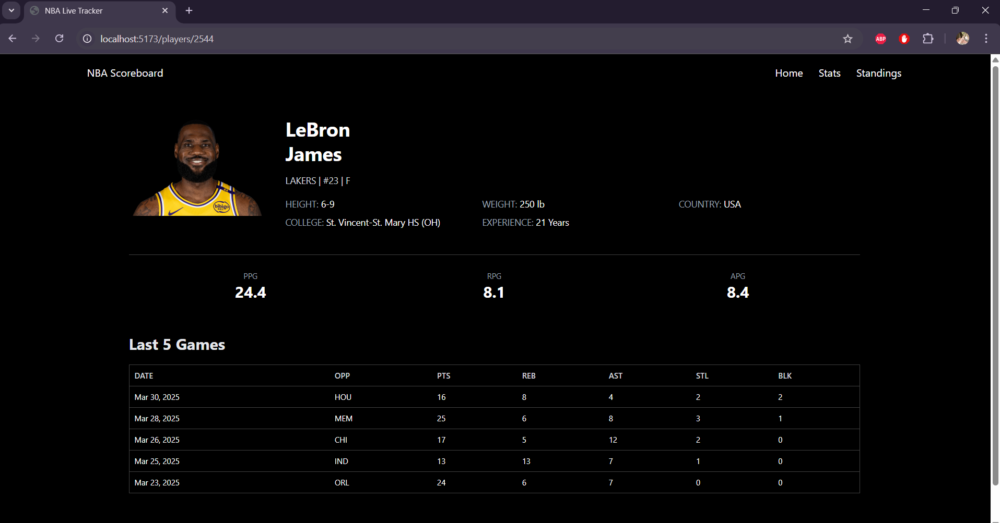
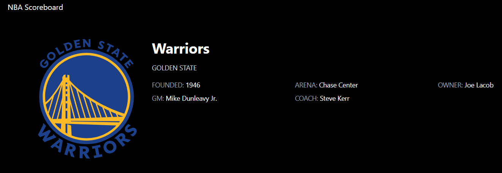

# NBA Scoreboard API

The **NBA Scoreboard API** is a FastAPI backend designed to provide real-time and historical NBA game data. It acts as a middleware layer, fetching raw data from the [`nba_api`](https://github.com/swar/nba_api) package, processing it, and exposing structured API endpoints.

## What This API Does

- **Fetches and Processes Data:** Retrieves data from the NBA's live API (`nba_api`).
- **Exposes Custom RESTful API Endpoints:** Provides endpoints for frontend use.

## Features

- Live scoreboard with real-time game updates
- Game leaders
- Play-by-play breakdown of game events
- Team schedule, records, and rosters
- Player search and statistics





## Getting Started

### Run with Docker

Ensure you have Docker installed and running.

1.  **Clone the Repository:**

    ```bash
    git clone [https://github.com/your-username/nba-live-tracker.git](https://github.com/your-username/nba-live-tracker.git)
    cd nba-live-tracker
    ```

2.  **Build the Docker Containers:**

    ```bash
    docker-compose build
    ```

3.  **Start the Application:**

    ```bash
    docker-compose up
    ```

### Manual Setup (Without Docker)

1.  **Navigate to the API Directory:**

    ```bash
    cd nba-live-tracker/nba-tracker-api
    ```

2.  **Create and Activate a Virtual Environment:**

    ```bash
    python -m venv venv
    venv\Scripts\activate  # On Windows
    source venv/bin/activate # On macOS and Linux
    ```

3.  **Install Dependencies:**

    ```bash
    pip install -r requirements.txt
    ```

4.  **Run the API:**

    ```bash
    uvicorn main:app --reload
    ```

5.  **Access the API Documentation:**

    - **Swagger UI:** [http://localhost:8000/docs](http://localhost:8000/docs)
    - **Redoc:** [http://localhost:8000/redoc](http://localhost:8000/redoc)
    - **Main API Page:** [http://localhost:8000](http://localhost:8000)

## Technologies Used

### Backend (FastAPI)

- Python
- FastAPI
- `nba_api`

### Frontend (React)

- React.js
- TypeScript
- Tailwind CSS
- Vite
