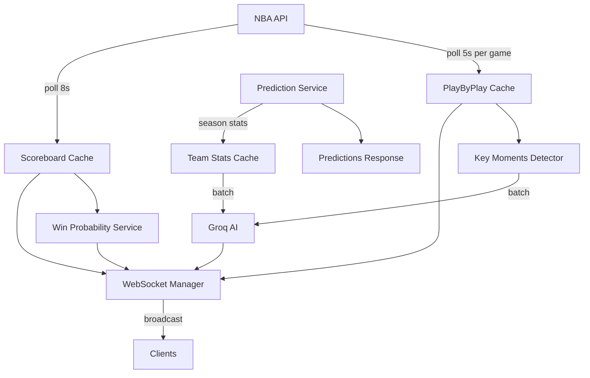
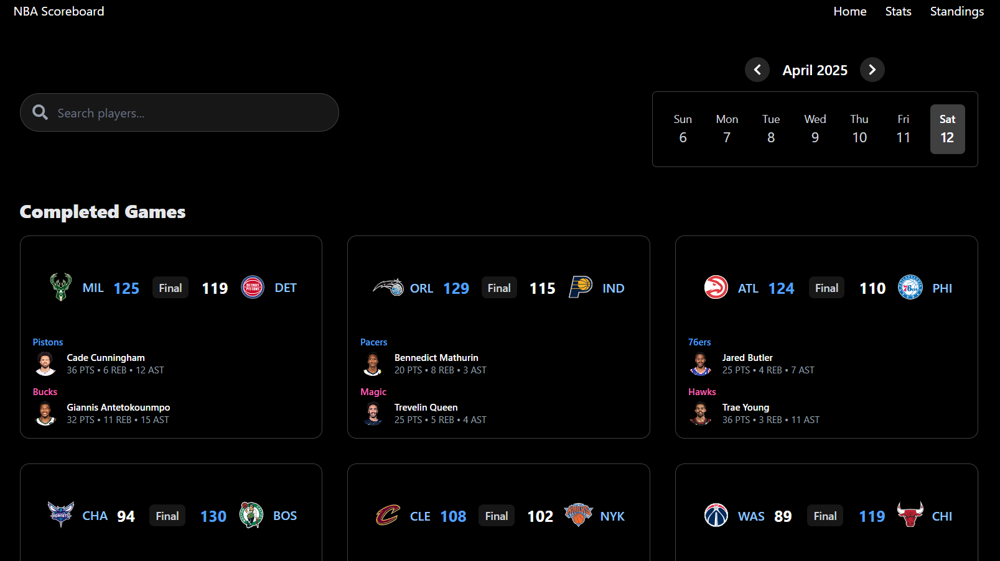

# NBA Live Tracker

Real-time NBA intelligence platform — live scores, AI-generated insights, and key moment detection, built on a cache-first event-driven backend.

**Live Demo:** [https://nba-live-tracker-one.vercel.app](https://nba-live-tracker-delta.vercel.app)

---

## Architecture

The backend uses a **cache-first, poll-once** pattern:

- A single background poller fetches from the NBA API at fixed intervals (scoreboard every 8s, play-by-play every 5s per live game).
- All WebSocket connections read from this shared in-memory cache. **100 concurrent users = 1 API call, not 100.**
- WebSocket handlers never call the NBA API directly; they only broadcast cached data.
- Groq AI calls are batched (e.g. one call for all live game insights, one for all key moment contexts) to stay within rate limits.


```mermaid
graph TD
    NBA[NBA API] -->|poll 8s| SC[Scoreboard Cache]
    NBA -->|poll 5s per game| PBP[PlayByPlay Cache]
    SC --> WS[WebSocket Manager]
    PBP --> WS
    PBP --> KM[Key Moments Detector]
    KM -->|batch| GQ[Groq AI]
    GQ --> WS
    SC --> WP[Win Probability Service]
    WP --> WS
    WS -->|broadcast| C1[Clients]
    PS[Prediction Service] -->|season stats| TS[Team Stats Cache]
    TS -->|batch| GQ
    PS --> PR[Predictions Response]
```

### Key Design Decisions

| Decision | Reason |
|----------|--------|
| **Separate polling intervals** | Scoreboard (8s) and play-by-play (5s) have different update frequencies; decoupling avoids blocking. |
| **Batch Groq calls** | One call per game would blow rate limits. All insights for all games are batched into one request. Same for key moment context and prediction insights. |
| **LRU eviction everywhere** | Bounded memory: play-by-play (20 games), predictions (100 entries), moment contexts (1000), win probability (20). Finished games are cleaned immediately. |
| **WebSockets read-only from cache** | Ensures a single source of truth and no thundering herd on the NBA API. |

### Key Moments Detection

The backend analyzes play-by-play in real time and detects 5 moment types:

| Type | Detection Logic |
|------|-----------------|
| **Game-Tying Shot** | Score tied now, was not tied before, and play is a scoring play |
| **Lead Change** | Different team leading vs previous play |
| **Scoring Run** | 8+ unanswered points (turnovers/fouls/timeouts do not break the run) |
| **Clutch Play** | Scoring play in Q4+ with &lt;2 min left and score within 5 |
| **Big Shot** | 3-pointer that extends lead to 10+ or cuts deficit to 5 or less |

Each detected moment is sent to Groq in batch for a one-sentence explanation. If Groq fails, moments still appear without context (graceful degradation).

---

## Tech Stack

**Backend:** FastAPI, Python, WebSockets, Groq (llama-3.1-8b-instant), [`nba_api`](https://github.com/swar/nba_api)  
**Frontend:** React 19, TypeScript, Material UI, Recharts, Vite  
**Observability:** `GET /api/v1/health` — cache state, polling status, WebSocket connection counts, Groq rate limit usage

---

## Running Locally

### Prerequisites

- [Docker](https://docs.docker.com/get-docker/) (for Docker path); [Git](https://git-scm.com/downloads)
- For manual setup: Node.js LTS, Python 3.11+

### Quick Setup (Docker)

1. Clone and set environment:
   ```bash
   git clone https://github.com/Warsame-Egal/nba-live-tracker.git
   cd nba-live-tracker
   cp .env.example .env
   ```
   Edit `.env` with your `GROQ_API_KEY` (see `.env.example`).

2. Start the app:
   ```bash
   docker-compose up --build
   ```
   **Frontend** http://localhost:3000 · **API** http://localhost:8000 · **API Docs** http://localhost:8000/docs

### Manual Setup

**Backend:**

```bash
cd nba-tracker-api
python -m venv venv
venv\Scripts\activate   # or source venv/bin/activate on macOS/Linux
pip install -r requirements.txt
cp .env.example .env   # set GROQ_API_KEY etc.
uvicorn app.main:app --reload
```

**Frontend:**

```bash
cd nba-tracker
npm install
npm run dev
```

Frontend: http://localhost:3000 (or next available port).

---

## What It Does

- **Live Scoreboard** — Real-time scores, play-by-play, AI insights, win probability
- **Key Moments** — Game-tying shots, lead changes, scoring runs, clutch plays, big shots (with optional AI context)
- **Momentum Chart** — Score differential over time with quarter markers
- **Predictions** — Win probability (season + recent form + net rating), score prediction, matchup narrative, key drivers, risk factors
- **Player & Team Stats** — Season leaders, team performance, game logs, comparisons
- **Post-Game Recap** — Short AI recap for completed games (`GET /api/v1/game/{id}/recap`)

---

## API Reference

- **Health:** `GET /api/v1/health` — Returns cache stats, polling status, WebSocket counts, Groq usage. Never throws.
- **Game detail:** `GET /api/v1/game/{game_id}/detail` — Aggregated score, box score, player impacts, key moments, win probability.
- **Post-game recap:** `GET /api/v1/game/{game_id}/recap` — AI recap for finished games (cached permanently).
- **API Docs (Swagger):** http://localhost:8000/docs

---

## MCP Server — Use With Claude or Cursor

The NBA Live Tracker exposes its data pipeline as an MCP (Model Context Protocol) server so AI assistants can query live NBA data.

### Setup

1. Start the backend locally (`uvicorn app.main:app --reload` from `nba-tracker-api`).
2. Add to your Claude Desktop config (e.g. `claude_desktop_config.json`):

```json
{
  "mcpServers": {
    "nba-tracker": {
      "command": "python",
      "args": ["/path/to/nba-live-tracker/nba-tracker-api/app/mcp_server.py"],
      "env": { "PYTHONPATH": "/path/to/nba-live-tracker/nba-tracker-api" }
    }
  }
}
```

3. Restart Claude Desktop.

### What You Can Ask Claude

- "Which NBA games are live right now and what are the scores?"
- "How is Stephen Curry performing this season compared to his career averages?"
- "What does the model predict for tonight's Lakers game?"
- "Show me the current Western Conference standings"

The MCP server connects Claude directly to the same real-time data pipeline that powers the web app.

### Tools

- **get_live_scoreboard** — Today's games with live scores
- **get_player_stats** — Season stats and game log by player name
- **get_game_detail** — Box score, key moments, win probability by game ID
- **get_standings** — Conference standings
- **get_predictions** — Win probability predictions by date
- **get_league_leaders** — Season leaders by stat (PTS, REB, AST, STL, BLK)

### Verify

From `nba-tracker-api`: `python test_mcp.py` (backend must be running). See `mcp_config.json` at repo root for a full config example.

---

## Screenshots

<div style="display: flex; flex-wrap: wrap; gap: 10px; justify-content: center;">
  
</div>

---

## Documentation

- **Architecture:** [docs/architecture.md](docs/architecture.md)
- **API Docs:** http://localhost:8000/docs
- **Full API reference:** [nba-tracker-api/app/docs/API_DOCUMENTATION.md](nba-tracker-api/app/docs/API_DOCUMENTATION.md)
- **Groq AI details:** [docs/groq-ai.md](docs/groq-ai.md)

## Deployment

- **Frontend:** Vercel
- **Backend:** GCP. See [MANUAL_SETUP.md](MANUAL_SETUP.md) for SSH, pull, and redeploy.

## Data Source

Uses the [`nba_api`](https://github.com/swar/nba_api) Python package. Version pinned in `nba-tracker-api/requirements.txt`.

## Testing & CI

- **Backend:** pytest in `nba-tracker-api/app/tests/`. Run: `pytest` from `nba-tracker-api`. No live API keys required.
- **Frontend:** ESLint, Prettier, production build in CI.
- **CI:** [.github/workflows/ci.yml](.github/workflows/ci.yml) — backend (ruff, black, pytest), frontend (TypeScript, eslint) on push/PR to `main` and `dev`.

Made by Warsame Egal
