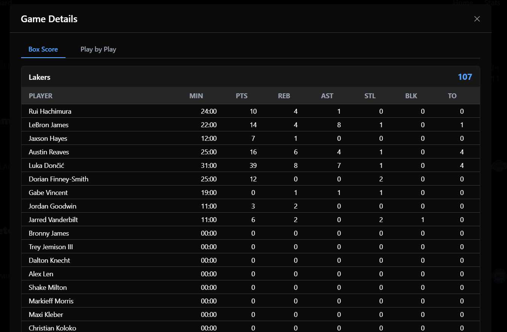

# NBA Scoreboard API

The NBA Scoreboard API by Warsame Egal is a FastAPI backend that provides real-time and historical NBA game data. It wraps the [`nba_api`](https://github.com/swar/nba_api) to expose clean RESTful endpoints for a polished frontend experience.

### What It Does

- Fetches live and historical NBA data using `nba_api`
- Exposes RESTful API endpoints for use in frontend apps
- Processes and cleans raw NBA data before exposing it

### Features

- Live scoreboard with real-time WebSocket updates
- Game leaders and top scorers
- Play-by-play breakdowns
- Full team schedule and rosters, and standings
- Player profiles and stats





### Environment Variables

#### Frontend (`nba-tracker`)

- `VITE_API_BASE_URL` - Backend API URL (default: `http://localhost:8000`)
- `VITE_WS_URL` - WebSocket URL without protocol (default: `localhost:8000`)

Create `.env` files in each directory based on these variables for local development.

**Note:** This application uses the NBA API directly. All data is fetched in real-time from the NBA API.

### Getting Started

### Option 1: Run with Docker

Ensure [Docker](https://www.docker.com/) is installed and running.

### Clone the Repository:

```bash
git clone https://github.com/Warsame-Egal/nba-live-tracker.git
cd nba-live-tracker
```

### Build the Docker Containers:

```bash
docker-compose build
```

### Start the App:

```bash
docker-compose up
```

### Access the app:

Frontend: http://localhost:3000  
Backend: http://localhost:8000

### Option 2: Manual Backend Setup (Without Docker)

### Navigate to Backend Folder:

```bash
cd nba-live-tracker/nba-tracker-api
```

### Create and Activate Virtual Environment:

```bash python -m venv venv
venv\Scripts\activate
```

### Install Python Dependencies:

```bash
pip install -r requirements.txt
```

### Run the Backend:

```bash
uvicorn app.main:app --reload
```

### Access API:

Swagger Docs → http://localhost:8000/docs  
ReDoc → http://localhost:8000/redoc

## Technologies Used

### Backend

Python  
FastAPI + Uvicorn  
nba_api (NBA data wrapper)
WebSocket  
Docker & Docker Compose

### Frontend

React + TypeScript  
Tailwind CSS  
Vite
