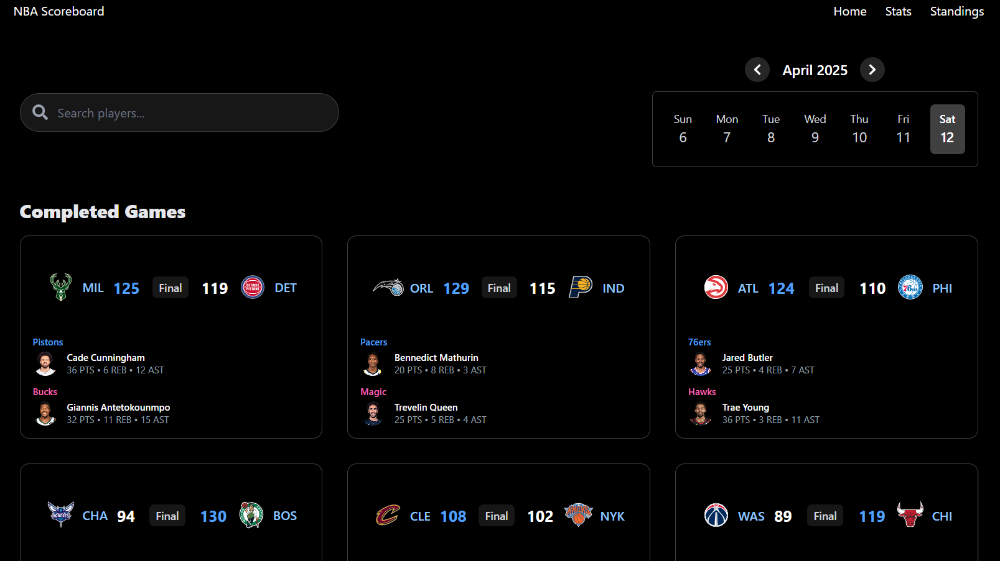
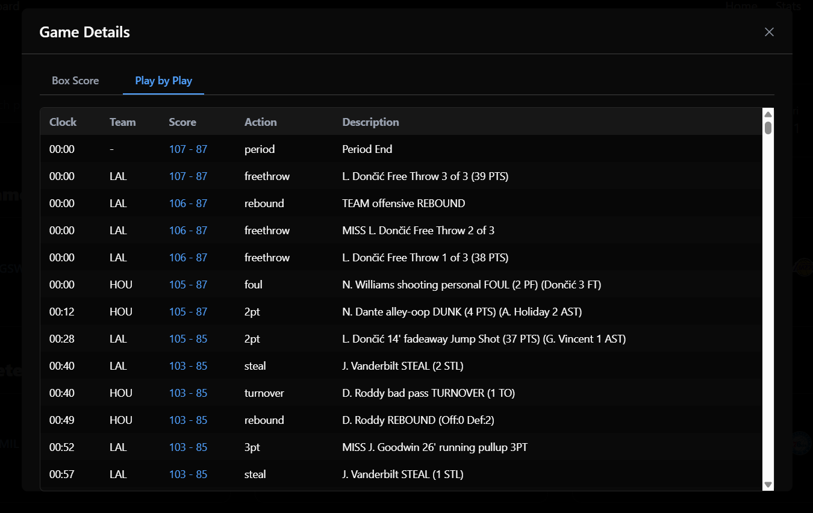

# NBA Live Tracker

A real-time NBA scoreboard and stats tracker built with React and FastAPI. Watch live games, track player stats, browse team rosters, and stay up-to-date with league standings.

**Live Demo:** [nba-live-tracker.vercel.app](https://nba-live-tracker.vercel.app)

The app is fully deployed and working. Frontend is on Vercel, backend API is running on Oracle Cloud Infrastructure.

## Screenshots

<div align="center">
  
  
  
  <br>
  
  
  
  <br>
  
</div>

## Features

- **Live Scoreboard** - Real-time score updates as games happen
- **Play-by-Play** - See every shot, foul, and timeout as it happens
- **Player Profiles** - View player stats and recent game performances
- **Team Rosters** - Browse full team lineups with player details
- **League Standings** - Track playoff races and conference rankings
- **Smart Search** - Find players and teams instantly
- **Game Leaders** - See top performers with season averages for upcoming games and live stats for active games

## Quick Start

### Running Locally

**Using Docker:**

```bash
git clone https://github.com/Warsame-Egal/nba-live-tracker.git
cd nba-live-tracker
docker-compose up --build
```

Then open:

- Frontend: http://localhost:3000
- Backend API: http://localhost:8000
- API Docs: http://localhost:8000/docs

**Manual Setup:**

**Backend:**

```bash
cd nba-tracker-api
python -m venv venv
venv\Scripts\activate  # On Windows
# source venv/bin/activate  # On Mac/Linux
pip install -r requirements.txt
uvicorn app.main:app --reload
```

**Frontend:**

```bash
cd nba-tracker
npm install
npm run dev
```

The frontend will run on http://localhost:3000 (or the next available port).

## Tech Stack

**Frontend:**

- React 19 with TypeScript
- Material UI for components
- Vite for building
- React Router for navigation
- WebSockets for real-time updates

**Backend:**

- FastAPI with Python
- WebSockets for live scoreboard and play-by-play
- Uvicorn as the ASGI server
- Docker for containerization

**Data Source:**
Uses the [`nba_api`](https://github.com/swar/nba_api) Python package by [swar](https://github.com/swar) to fetch data from NBA.com.

**Deployment:**

- Frontend: Vercel (automatic HTTPS, global CDN)
- Backend: Oracle Cloud Infrastructure free tier (Ubuntu VM)
- Tunnel: Cloudflare Tunnel for secure HTTPS access to backend

See [DEPLOYMENT.md](DEPLOYMENT.md) for deployment details.

## API Usage Examples

### Get Player Details

```bash
curl http://localhost:8000/api/v1/player/2544
```

```python
import requests

response = requests.get("http://localhost:8000/api/v1/player/2544")
player = response.json()
print(player["PLAYER_FIRST_NAME"], player["PLAYER_LAST_NAME"])
```

### Get Live Scoreboard

```bash
curl http://localhost:8000/api/v1/scoreboard
```

### Get Games for Date

```bash
curl http://localhost:8000/api/v1/schedule/date/2025-01-15
```

### WebSocket for Live Updates

```javascript
const ws = new WebSocket("ws://localhost:8000/api/v1/ws");

ws.onmessage = (event) => {
  const data = JSON.parse(event.data);
  console.log("Live scores:", data);
};
```

## API Documentation

- Interactive docs: http://localhost:8000/docs
- Full documentation: [API_DOCUMENTATION.md](nba-tracker-api/app/docs/API_DOCUMENTATION.md)

## Deployment

The app is currently deployed and running. I deployed the backend to Oracle Cloud's free tier and the frontend to Vercel. I set up a Cloudflare Tunnel to give the backend HTTPS access without exposing the VM's public IP.

See [DEPLOYMENT.md](DEPLOYMENT.md) for detailed setup instructions.

## Project Structure

```
nba-live-tracker/
├── nba-tracker/          # Frontend React app
│   ├── src/
│   │   ├── components/   # UI components
│   │   ├── pages/        # Page components
│   │   ├── services/     # API services
│   │   └── types/        # TypeScript types
│   └── public/           # Static assets
└── nba-tracker-api/      # Backend FastAPI app
    └── app/
        ├── routers/       # API routes
        ├── services/     # Business logic
        └── schemas/       # Data models
```

## Credits

This project uses the [`nba_api`](https://github.com/swar/nba_api) Python package by [swar](https://github.com/swar) to access NBA.com data. The `nba_api` package is open source with an MIT License.

## License

This project is open source. See the [LICENSE](LICENSE) file for details.

---

Made by Warsame Egal
