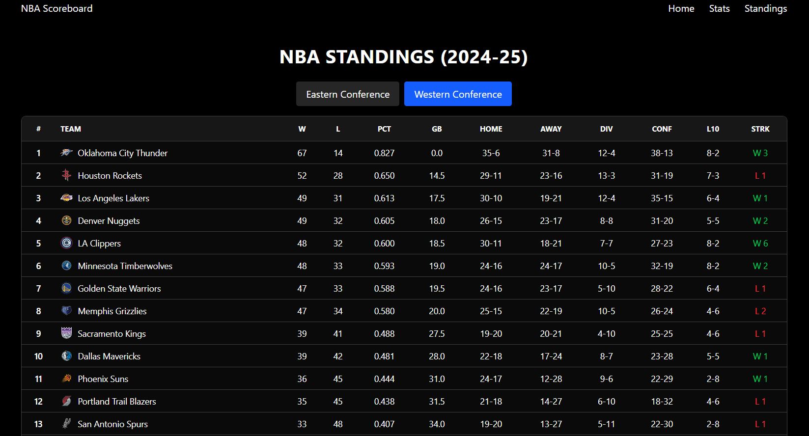

# 🏀 NBA Live Tracker

A real-time NBA scoreboard and stats tracker built with React and FastAPI. Watch live games, track player stats, browse team rosters, and stay up-to-date with league standings—all in one beautiful, modern interface.





## ✨ What Makes This Special

This isn't just another NBA stats app. It's a **real-time experience** that brings you closer to the game:

- **Live Scoreboard** - Watch scores update in real-time as games happen
- **Play-by-Play Updates** - See every shot, foul, and timeout as it happens
- **Player Profiles** - Deep dive into any player's stats and recent performances
- **Team Rosters** - Explore full team lineups with player details
- **League Standings** - Track playoff races and conference rankings
- **Smart Search** - Find players and teams instantly
- **Beautiful UI** - Clean, modern design built with Material UI

## 🚀 Quick Start

### The Easy Way (Docker)

If you have Docker installed, you're just a few commands away:

```bash
# Clone the repository
git clone https://github.com/Warsame-Egal/nba-live-tracker.git
cd nba-live-tracker

# Build and start everything
docker-compose up --build
```

That's it! Open your browser:
- **Frontend:** http://localhost:3000
- **Backend API:** http://localhost:8000
- **API Docs:** http://localhost:8000/docs

### Manual Setup (For Developers)

#### Backend Setup

```bash
# Navigate to the backend
cd nba-tracker-api

# Create a virtual environment (Windows)
python -m venv venv
venv\Scripts\activate

# Or on Mac/Linux
python3 -m venv venv
source venv/bin/activate

# Install dependencies
pip install -r requirements.txt

# Run the server
uvicorn app.main:app --reload
```

The API will be running at http://localhost:8000

#### Frontend Setup

```bash
# Navigate to the frontend (in a new terminal)
cd nba-tracker

# Install dependencies
npm install

# Start the development server
npm run dev
```

The frontend will be running at http://localhost:3000

## 🎯 Features in Detail

### Live Scoreboard
The main page shows all games happening today. Scores update automatically via WebSocket connections, so you never miss a point. Each game card shows:
- Current score and game status
- Top scorers for each team
- Game leaders (points, rebounds, assists)
- Quick access to detailed stats

### Play-by-Play
Click any game to see a detailed breakdown:
- **Box Score** - Complete team and player statistics
- **Play-by-Play** - Every event in chronological order with live updates
- Real-time updates as plays happen during live games

### Player Profiles
Search for any player and explore:
- Season averages (points, rebounds, assists, etc.)
- Recent game performances (last 5 games)
- Team information and jersey number
- Position and player details

### Team Pages
Dive into any team's information:
- Team details (arena, owner, head coach)
- Full roster with all players
- Team statistics and records

### Standings
Track the entire league:
- Conference rankings
- Win/loss records
- Playoff positions
- Current streaks

## 🛠️ Tech Stack

### Frontend
- **React 19** - Modern UI library
- **TypeScript** - Type-safe development
- **Material UI** - Beautiful, accessible components
- **Vite** - Lightning-fast build tool
- **React Router** - Smooth navigation
- **WebSockets** - Real-time updates

### Backend
- **FastAPI** - Modern, fast Python web framework
- **Python 3.12+** - Latest Python features
- **nba_api** - Official NBA data wrapper
- **WebSockets** - Real-time bidirectional communication
- **Uvicorn** - ASGI server for production

## 📡 API Documentation

The backend provides a comprehensive REST API and WebSocket endpoints. Check out the full documentation:

- **Interactive Swagger UI:** http://localhost:8000/docs
- **ReDoc:** http://localhost:8000/redoc
- **Detailed API Docs:** See [API_DOCUMENTATION.md](nba-tracker-api/app/docs/API_DOCUMENTATION.md)

### Quick API Examples

```bash
# Get player details
curl http://localhost:8000/api/v1/player/2544

# Search for players
curl http://localhost:8000/api/v1/players/search/lebron

# Get games for today
curl http://localhost:8000/api/v1/schedule/date/2024-01-15

# Get team roster
curl http://localhost:8000/api/v1/scoreboard/team/1610612747/roster/2024-25

# Search players and teams
curl "http://localhost:8000/api/v1/search?q=lakers"
```

## 🏗️ Project Structure

```
nba-live-tracker/
├── nba-tracker/          # Frontend React app
│   ├── src/
│   │   ├── components/   # Reusable UI components
│   │   ├── pages/       # Page components
│   │   ├── services/    # API and WebSocket services
│   │   ├── types/       # TypeScript type definitions
│   │   └── utils/       # Utility functions
│   └── public/          # Static assets
│
└── nba-tracker-api/      # Backend FastAPI app
    └── app/
        ├── routers/      # API route handlers
        ├── services/     # Business logic
        ├── schemas/      # Pydantic models
        └── docs/         # API documentation
```

## 🔧 Development

### Running Tests

```bash
# Backend tests
cd nba-tracker-api
pytest

# Frontend linting
cd nba-tracker
npm run lint
```

### Building for Production

```bash
# Frontend
cd nba-tracker
npm run build

# Backend (already production-ready with Uvicorn)
```

## 🤝 Contributing

Contributions are welcome! Feel free to:
- Report bugs
- Suggest new features
- Submit pull requests
- Improve documentation

## 📝 License

This project is open source. See the [LICENSE](LICENSE) file for details.

## 🙏 Acknowledgments

- Built with the amazing [nba_api](https://github.com/swar/nba_api) library
- NBA data provided by the official NBA stats API
- UI components from [Material UI](https://mui.com/)

---

**Made with ❤️ by Warsame Egal**

Enjoy tracking your favorite NBA teams and players! 🏀
